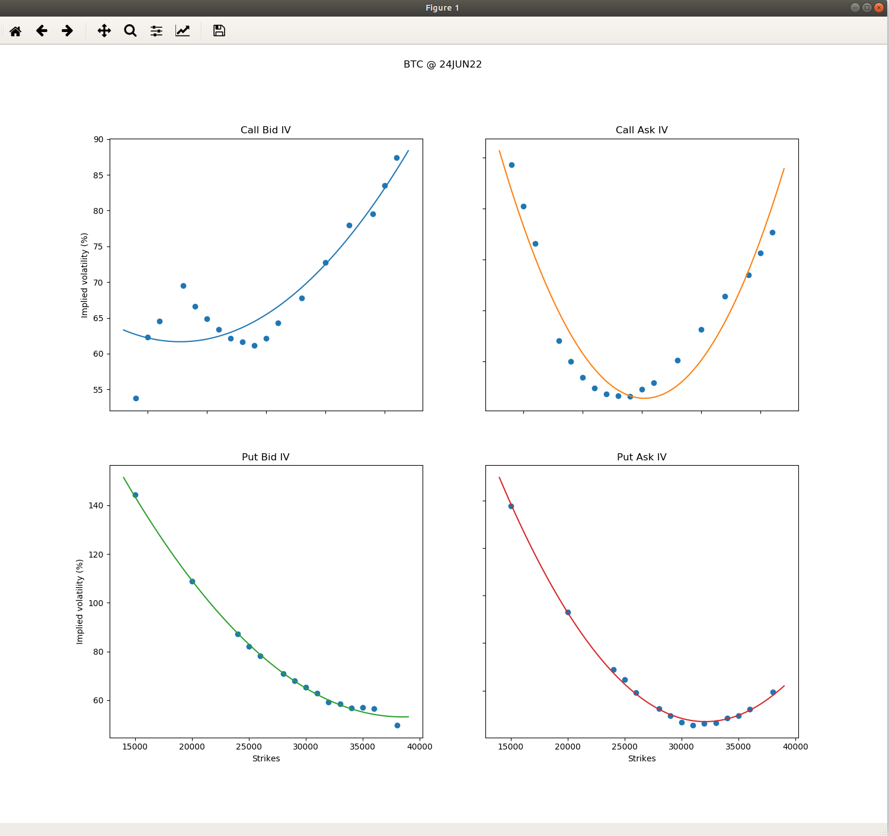

# BTC Option IV Curve
Real Time IV Curve Construction For BTC Option Data From deribit.com

## Usage
```
# Requirement: python > 3.7
# Update the API secret(client_id, client_secret) in the python script

$ pip install -r ./requirements.txt
$ python test.py

```

## Sample Log
```
Call Strike     Bid IV     Ask IV    
24000           65.03      111.2     
25000           67.24      102.81    
26000           67.64      95.18     
28000           68.87      73.31     
29000           66.51      69.84     
30000           64.66      66.56     
31000           62.98      64.91     
32000           62.17      63.57     
33000           61.41      63.03     
34000           61.68      63.64     
35000           62.62      65.06     
36000           64.74      66.27     
38000           68.13      70.57     
40000           73.06      76.61     
42000           78.28      83.1      
44000           79.82      87.26     
45000           83.82      91.53     
46000           87.71      95.68     

Put Strike      Bid IV     Ask IV    
15000           143.96     157.27    
20000           108.45     112.76    
24000           86.78      88.41     
25000           81.52      84.1      
26000           77.6       79.68     
28000           70.09      71.57     
29000           67.19      69.19     
30000           64.92      66.19     
31000           62.84      65.41     
32000           60.17      66.45     
33000           57.71      65.85     
34000           57.46      67.33     
35000           57.68      69.93     
36000           57.02      72.72     
38000           47.79      79.36     

Call Bid IV: 
           2
1.115e-07 x - 0.006975 x + 172.2

Call Ask IV: 
          2
3.37e-07 x - 0.02379 x + 482.6

Put Bid IV: 
           2
1.626e-07 x - 0.01253 x + 294.4

Put Ask IV: 
           2
3.166e-07 x - 0.02027 x + 391.2
```

## Screenshot
